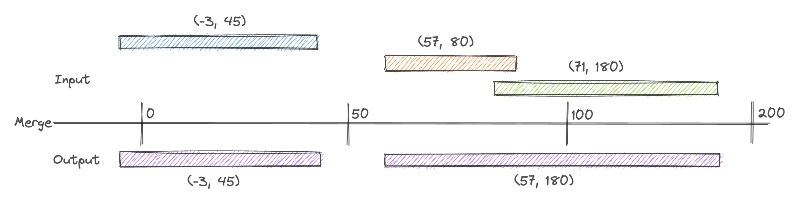

# Merge function for intervals

## Motivation

There are several use-cases where it's important that given intervals need to be merged together. 
These are e.g. calendar apps where meetings should be scheduled (or block phases need to be calculated) or 
doings of different craftmans in your house need to calculated. 

In these cases it is needed to merge different events - with possible overlaps - to the maximum possible
single event.

## Technical Example

This small Kotlin app works with intervals. Every interval consists of a `Pair` of two values where the first
value must be smaller than the second one. Negative values on both sides are allowed under this condition.

Like you see in the image we get an input of three different pairs where the second and the third have some 
overlap. The `Pair`s of `Pair(-3, 45)`, `Pair(57, 80)` and `Pair(71, 180)` are being sorted at the beginning. So an input
of e.g. `Pair(57, 80)`, `Pair(71, 180)` and `Pair(-3, 45)` does not make any difference for the outcome.


After executing the merge function these `Pair`s staying untouched where no overlap is recognised else being merged together into
one bigger interval. The return value is a sorted `List` of `Pair`s.



## Run the app

The application can be used as library. Therefore you need to create the jar file and include it into your project.

To do this you can simply run the maven goal for building the app (it will also execute all tests):

```mvn install```

If you want to run the tests only:

```mvn test```

After including the library into your application you can use the ```IntervallService``` for calling the function
```merge```.

## How to extend the app for own use cases or tests

You can find under `/src/main/resources/` the `input.json` file with a very small example of possible inputs. 

Your JSON file you handed over should contain an array of interval-arrays. E.g.

```json
[
    [25, 35],
    [-4, 12],
    [20, 80]
]
```

The helper class `InputReader.kt` provides a method for reading this array of data and returns it as a format which
can be used as input of the algorithm. This simplifies the possibility of testing and improving the algorithm for different 
amount of input data. You can adjust the content `input.json` to test the function with different inputs. 

For huge amount of data being tested you can use [this](https://onlineintegertools.com/generate-integer-pairs) online tool for creating randomized arrays of integers.

Following snipped you can use to play around (e.g. for checking execution time) with different amount of data provided in the ```ìnput.json```.

```kotlin
@OptIn(ExperimentalTime::class)
fun main(args: Array<String>) {
    InputReader().readInputs(File("../input.json"))?.let {
        val elapsed = measureTime {
            IntervalService().merge(it)
        }
        println("Exectiontime: $elapsed")
    }
}
```

